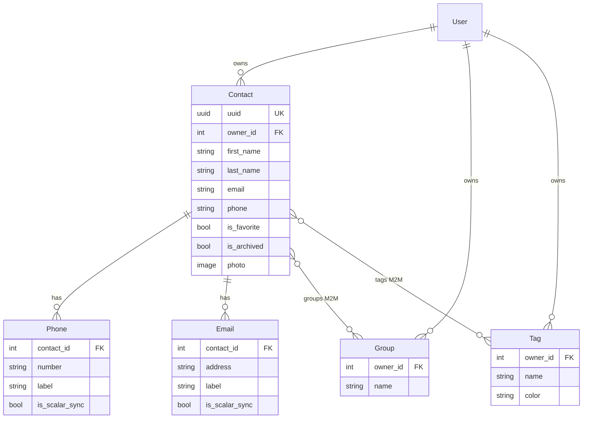

# Schema Reference

Entity-relationship overview for the Address Book Portal data model.

## Diagram

## Entities

### Contact

Primary record. Scalar `phone` and `email` fields support the v1 UI and CSV import. Related `Phone` / `Email` rows support vCard export, admin inlines, and search.

| Field | Notes |
|-------|-------|
| `uuid` | Stable vCard `UID`; unique, auto-generated |
| `owner` | FK to `User`; all queries scoped by owner |
| `is_archived` | Soft delete flag |
| `is_favorite` | Favorites list (excludes archived) |
| `photo` | Stored under `contacts/user_<id>/photos/` |

Indexes: `(owner, is_archived)`, `(owner, is_favorite)`, `(last_name, first_name)`.

### Phone

| Label | Purpose |
|-------|---------|
| `mobile` | Primary phone; scalar sync target |
| `work`, `home` | Additional numbers |

`is_scalar_sync=True` rows are managed by `ContactForm.sync_primary_records()`; other rows are preserved.

### Email

| Label | Purpose |
|-------|---------|
| `other` | Primary email; scalar sync target |
| `work`, `home` | Additional addresses |

Same `is_scalar_sync` semantics as `Phone`.

### Group / Tag

Per-user organization labels with many-to-many links to contacts.

**Constraints:** case-insensitive unique `(Lower(name), owner)` on both tables (migrations `0002_case_insensitive_group_tag_names`).

M2M pre-add signals reject cross-owner contact links.

## Validation boundaries

| Path | Validation |
|------|------------|
| Portal forms | `ContactForm`, `GroupForm`, `TagForm` |
| Model save | `Contact.save()` → `full_clean()` |
| CSV import | `contact.full_clean()` per row |
| Bulk SQL / `update()` | Not validated — avoid in application code |

## Related documentation

- [ADR 0004 — Scalar vs related fields](adr/0004-scalar-and-related-contact-fields.md)
- [SECURITY.md](SECURITY.md) — ownership and media controls
- [SPEC.md](SPEC.md) — functional requirements
